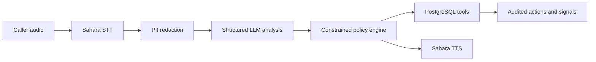

# FaultBridge

FaultBridge is a code-switched voice support agent for Nigerian mobile networks.
It turns a caller's complaint into a verified answer, a safe action, and useful
network evidence.

A telco may know about a fibre cut before its customers do, yet every caller still
explains the same outage from scratch. FaultBridge connects the customer support
call to verified NOC and account data. It supports Pidgin-English, Hausa-English,
Igbo-English, and Yoruba-English.

## What the Agent Does

1. Sahara transcribes the caller with an explicit language selection.
2. FaultBridge redacts personal identifiers before model analysis or storage.
3. A structured LLM extracts the issue without receiving authority to run tools.
4. The policy engine checks the exact cell, account state, and approved playbooks.
5. It queues an idempotent callback or compensation command when policy permits.
6. Unresolved complaints become tickets and distinct-caller network signals.
7. Three matching unresolved callers can propose an **unconfirmed** NOC incident.
8. Sahara speaks the grounded response in the caller's selected language.

The submission uses Sahara for speech and Together-hosted Llama 3.3 70B for
structured complaint analysis. Speech, model, and telephony implementations sit
behind provider interfaces.

## Run the Working Prototype

Install Docker and [uv](https://docs.astral.sh/uv/), then:

```bash
cp .env.example .env
# Set strong local secrets plus SAHARA_API_KEY and TOGETHER_API_KEY.
make docker-up
make demo-seed
```

Open `http://localhost:8010/` for caller support and
`http://localhost:8010/operations` for the protected operations workspace.
`make demo-seed` loads a labelled synthetic incident and account through the
same authenticated ingestion API used by real integrations.

```bash
make test           # run 90 unit and PostgreSQL integration tests
make lint           # check formatting and static rules
make docker-status  # inspect container health
make docker-down    # stop the local stack
```

No separate frontend service is required. The FastAPI container serves both
responsive web interfaces.

## Architecture



Only the policy engine can invoke tools. Confirmed outage answers require an exact
match against a verified incident record. Approximate retrieval is never used as
proof of a fault. Read [Architecture](docs/ARCHITECTURE.md) and
[Benchmark Methodology](docs/BENCHMARK_METHODOLOGY.md) for the boundaries,
tradeoffs, and evaluation design.

## Benchmark Evidence

The [three-page report](docs/BENCHMARK_REPORT.pdf) evaluates components and the
complete agent:

| Track | Evidence | Headline result |
| --- | ---: | --- |
| Natural ASR | 400 AfriSwitch clips, 4 systems | Sahara 55.0% equal-language WER |
| Code-switched TTS | 200 Sahara outputs, 3 ASR judges | 200 of 200 generated |
| Agent task execution | 648 LLM and PostgreSQL runs | Sahara transcript path 100% strict success |
| Privacy | 100 labelled synthetic cases | 100% exact typed-span F1 within scope |

Failures and empty transcripts remain in the denominator. Raw JSONL contains
provider metadata, hashes, latency, and error records so aggregates can be
recomputed. The natural-audio evidence is private because AfriSwitch access terms
must be preserved:
[`Tiamz/faultbridge-asr-benchmark-evidence`](https://huggingface.co/datasets/Tiamz/faultbridge-asr-benchmark-evidence),
revision `ef320d7f367e040c47b4021a397011dae894fe00`.

Automatic TTS scores are diagnostic signals. A qualified bilingual listening
audit remains pending, so this project makes no MOS or human-quality claim.
Commands and metric definitions are in [eval/README.md](eval/README.md), with the
full explanation in the
[Technical Guide](docs/FAULTBRIDGE_TECHNICAL_GUIDE.md).

## Submission Materials

- [Benchmark report](docs/BENCHMARK_REPORT.pdf)
- [Benchmark methodology](docs/BENCHMARK_METHODOLOGY.md)
- [Architecture](docs/ARCHITECTURE.md)
- [Technical guide](docs/FAULTBRIDGE_TECHNICAL_GUIDE.md)
- [Responsible AI note](docs/RESPONSIBLE_AI.md)

The final local video master is
`artifacts/demo-video/FaultBridge-Intron-Demo.mp4`. Generated media is ignored
by Git; the submitted YouTube URL should point to this verified 4 minute 47 second
cut.

## Data and Security Boundary

The repository contains no real subscriber, account, incident, or caller records.
Raw call audio stays in memory. Stored callers are pseudonymous, transcripts are
redacted, and authenticated deletion and retention controls are implemented.
Credentials belong only in the ignored `.env` file. Review
[Responsible AI](docs/RESPONSIBLE_AI.md) before connecting a real operator system.

## License

Copyright © 2026 Hamzat Tiamiyu. All rights reserved. Hackathon organizers and
judges may run the project for evaluation. No permission is granted for other use,
copying, modification, redistribution, deployment, or commercial exploitation.
See the [proprietary license](LICENSE) for the complete terms.
