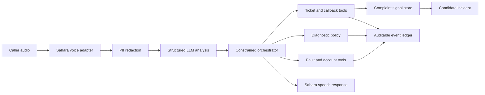

# Architecture

FaultBridge composes sponsor-specific voice providers around a shared telco domain
engine. Sahara supplies speech input and output by default in this repository. The
domain engine receives a redacted transcript plus verified call metadata and
returns a response, tool events, and an explicit terminal state.

The composition root selects four protocols: `SpeechToText`, `AgentModel`,
`TextToSpeech`, and `TelephonyTransport`. Provider adapters cannot access the
database or invoke telco actions. The LLM extracts a constrained symptom and
language pair; only the orchestrator can execute typed tools.

Authoritative operational facts use exact PostgreSQL queries. Approximate semantic
retrieval is not used to confirm an outage. Approved PostgreSQL playbooks supply
diagnostic instructions. Exact filters select a verified version, and every
customer-facing fact and state-changing action remains grounded in a typed tool
result.

The LLM extracts symptoms and language hints within a fixed schema. The
orchestrator enforces consent, required fields, valid state transitions,
idempotency, clustering thresholds, and terminal outcomes.

NOC and CRM systems publish verified state through authenticated internal API
boundaries. Every record carries a source system, source reference, and verification
time. Compensation and callbacks use durable, idempotent command tables so external
workers can execute them without losing work or duplicating actions.

## Key Decisions

Sahara is the default speech path because it led the frozen four-model ASR panel.
Every speech request includes an explicit language. An evidence-gated router is
implemented, but remains disabled because no alternative passed the accuracy,
latency, and downstream safety gates across all four language pairs.

PostgreSQL stores operational truth and supports concurrent API and worker access,
row locking, durable command queues, JSON audit events, and idempotency constraints.
It also keeps local Docker and hosted deployments on the same schema.

Verified incidents and approved playbooks use exact, versioned queries with
provenance. Semantic retrieval cannot establish that a network fault exists, so a
vector database is outside the authoritative decision path. Privacy checks happen
before external model reasoning: caller identifiers are pseudonymized, transcripts
are redacted, and raw audio is processed in memory without retention.

The synthetic demo enters through the authenticated NOC and CRM ingestion API, then
uses the same Sahara, Together, policy, PostgreSQL, and tool boundaries as a live
request. This keeps the demonstration repeatable without replacing production logic
with response fixtures.
