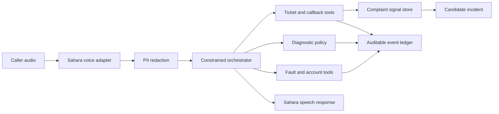

# Architecture

FaultBridge separates the sponsor-specific voice edge from the shared telco domain
engine. Sahara supplies speech input and output for this repository. The domain
engine receives a transcript plus verified call metadata and returns a response,
tool events, and an explicit terminal state.

Authoritative operational facts use exact PostgreSQL queries. Approximate semantic
retrieval is not used to confirm an outage. Future retrieval may suggest a support
playbook, but every customer-facing fact and state-changing action must remain
grounded in a typed tool result.

The LLM will extract symptoms and choose from currently allowed actions. The
orchestrator enforces consent, required fields, valid state transitions,
idempotency, clustering thresholds, and terminal outcomes.

NOC and CRM systems publish verified state through authenticated internal API
boundaries. Every record carries a source system, source reference, and verification
time. Compensation and callbacks use durable, idempotent command tables so external
workers can execute them without losing work or duplicating actions.
