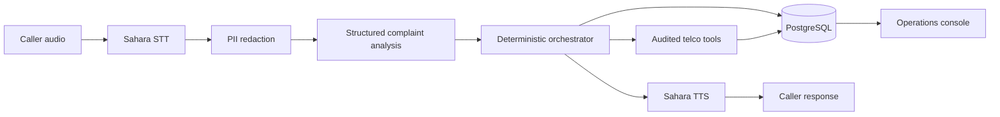

# FaultBridge Technical Explanation Guide

## What FaultBridge Is

FaultBridge is a code-switched voice support agent for Nigerian telecom faults. A
caller can describe a problem in Hausa-English, Igbo-English, Nigerian
Pidgin-English, or Yoruba-English. FaultBridge transcribes the audio, removes
sensitive identifiers, understands the complaint, checks verified operational
data, takes permitted actions, and speaks a grounded response.

The central product idea is a two-way bridge. Existing fault information moves
from a telco network operations centre to affected customers. In the other
direction, repeated unresolved complaints become an **unconfirmed candidate
incident** for NOC review. The application never presents a crowd signal as a
confirmed outage.

## Why It Is Agentic

An agent observes input, chooses and executes tools, changes state, and evaluates
the result. FaultBridge does all four. The language model has a narrow job: extract
the language pair, consent signal, and one controlled symptom label. A deterministic
orchestrator then decides which typed tools may run. This split allows flexible
language understanding without letting a probabilistic model invent an outage,
account balance, compensation, or repair time.

The runtime is model-agnostic at its boundaries. `SpeechToText`, `TextToSpeech`,
and `AgentModel` protocols define the required methods. Sahara is the submitted
speech provider. Together-hosted Llama 3.3 70B performs structured complaint
analysis. Faster-Whisper, SBPN, and OmniASR are benchmark comparators and can be
replaced without changing the policy engine.

The repository map is:

- `src/faultbridge/adapters/`: Sahara and LLM provider implementations.
- `src/faultbridge/domain/`: call state and three-tier orchestration policy.
- `src/faultbridge/tools/`: typed, audited telco operations.
- `src/faultbridge/services/`: PostgreSQL, privacy, voice pipeline, and workers.
- `src/faultbridge/static/`: caller and operations web interfaces.
- `migrations/`: immutable PostgreSQL schema changes.
- `eval/faultbridge_eval/`: data preparation, model runners, metrics, and scorers.
- `benchmark/`: frozen public manifests, scenarios, and aggregate results.
- `eval/results/` and `artifacts/`: ignored private raw evidence and archives.
- `tests/`: unit and PostgreSQL-backed integration coverage.

## Runtime Architecture



The browser and API live in one FastAPI service. `/` serves the responsive caller
experience and `/operations` serves the operations console. Browser audio is sent
to FastAPI, then through the provider-neutral `VoicePipeline`. All Sahara ASR and
TTS calls include an explicit language value.

If consent is false, the pipeline does not send caller audio to STT or text to the
LLM. It stores an empty transcript, creates no tool events, and offers transfer to
a person. With consent, the raw transcript is immediately redacted before the LLM,
database, tool log, or UI receives it. Caller IDs are stored as stable HMAC-based
pseudonyms, which supports repeat-caller detection and deletion without retaining
the original number.

## The Three Resolution Tiers

**Tier 1: known fault.** `lookup_fault` checks the exact cell ID for a verified,
active incident. If it finds one, `inspect_account` checks eligibility,
`queue_compensation` creates an idempotent command when allowed, and
`schedule_callback` queues a restoration update. The response can mention only
the cause, area, and ETA returned by that incident record.

**Tier 2: individual diagnosis.** If there is no known incident, FaultBridge
checks the account and retrieves the most specific approved playbook. Missing
account data stays unknown. A barred line, empty balance, or healthy account takes
a different branch. The caller is asked to test the suggested step; the system
does not claim success before confirmation.

**Tier 3: escalation and discovery.** If the test fails, FaultBridge creates a
structured ticket and records a complaint signal by pseudonymous caller, cell,
symptom, and a 30-minute window. Three distinct callers cross the candidate
threshold. Duplicate calls from one person cannot inflate the count. The candidate
remains `unconfirmed` until an operator verifies or dismisses it.

Every tool input and output is recorded in `action_events`. Compensation and
callback tables use idempotency constraints, and the optional worker delivers
queued commands to configured operator webhooks with retry state.

## PostgreSQL Data Model

- `network_incidents`: verified NOC facts and provenance.
- `accounts`: pseudonymous CRM/billing state.
- `troubleshooting_playbooks`: approved, versioned diagnostic instructions.
- `call_sessions`: safe transcript, current tier, outcome, and response.
- `action_events`: auditable tool trace.
- `tickets`: one escalation ticket per call.
- `complaint_signals`: one signal per call for distinct-caller clustering.
- `candidate_incidents`: unconfirmed, confirmed, or dismissed crowd findings.
- `compensation_commands` and `callback_commands`: idempotent delivery outbox.

Internal ingestion endpoints require `X-Internal-API-Key`. Each operational record
includes a source system, source reference, and verification time. The UI cannot
turn synthetic demo state into an authoritative external fault.

“Known faults” are therefore not facts invented by us or copied from a static
internet list. Production faults must arrive through
`PUT /internal/network-incidents/{incident_id}` from an authorized NOC integration.
The benchmark uses clearly labelled synthetic incidents so expected actions can be
graded deterministically. The knowledge base is the approved, versioned playbook
table. PostgreSQL is sufficient for exact symptom, language, operator, and device
filters; a vector database would add operational complexity without improving the
current small, structured retrieval problem.

Intelligent speech-model routing is also deferred until the downstream safety
evidence is complete. `routing_recommender.py` will recommend another ASR only when
paired accuracy improves, failure and latency budgets pass, and critical agent
gates remain safe. Sahara remains the submission default.

## What the Interfaces Show

The caller interface selects a required language pair, obtains explicit consent,
records audio, shows processing progress, plays the spoken answer, and supports a
resolution-confirmation turn. The operations console shows recent outcomes,
candidate incidents, queued actions, and the tool timeline for a selected call.
It displays only the safe transcript and pseudonymous caller reference.

## Benchmark Design

The evaluation deliberately separates components so one good number cannot hide
another failure.

### Natural-speech ASR benchmark

The primary ASR panel contains 400 natural AfriSwitch clips: 100 each for
Hausa-English, Igbo-English, Pidgin-English, and Yoruba-English. The selection is
frozen across Code-Mixing Index, switch-count, duration, and source groups. Sahara,
SBPN Multilingual Base, Faster-Whisper `large-v3-turbo`, and Meta OmniASR CTC 300M
v2 receive the same audio. Failed and empty outputs remain in the denominator.

Headline equal-language WER was 55.0% for Sahara, 58.1% for SBPN, 71.2% for
OmniASR, and 81.5% for Faster-Whisper. Sahara led Hausa, Igbo, and Pidgin; the
Yoruba comparison was inconclusive. These high values reflect difficult natural
code-switched speech and must not be converted into “accuracy” by subtracting from
100%.

### Sahara TTS benchmark

One hundred genuine code-switched AfriSwitch texts were synthesized once with
Sahara's female voice and once with its male voice: 200 outputs. Three independent
ASR families transcribed every output to provide automatic fidelity indicators.
Generation succeeded for all 200 files. The macro WER seen by the three judges was
58.6% for Faster-Whisper, 51.3% for OmniASR, and 39.7% for SBPN. Judge disagreement
is why insertion, deletion, and segment flags are audit triggers rather than
confirmed TTS defects. A frozen 40-file bilingual listening audit still needs human
ratings before we can claim MOS or confirmed missing/extra speech.

### Privacy benchmark

The deterministic privacy panel contains 100 synthetic code-switched cases: 90
positive cases and 10 negative controls, balanced across languages. It contains
100 exact labelled spans across phone, email, account/SIM, and other numeric
identifiers. Exact typed-span precision, recall, and F1 were all 100%, with zero
leakage on this declared scope. Names, addresses, and fully word-spelled numbers
are outside that claim.

### Executable agent benchmark

Forty-eight scenarios, 12 per language, execute the real orchestrator, tools, and
isolated PostgreSQL database. They cover consent refusal, known faults,
compensation, playbooks, verification, escalation, crowd thresholds, barred and
empty-balance accounts, missing data, safe fallback, and PII. The oracle validator
has passed all 48. Final stochastic scores require an external OpenAI-compatible
LLM key.

A second 24-utterance panel measures actual ASR error propagation into agent
actions. Sahara TTS generated six distinct telco complaints per language, and all
four ASR models transcribed the same files. Across 360 Together Llama 3.3 70B
executions, strict task success was 100.0% for gold and Sahara transcripts, 95.8%
for SBPN, 87.5% for OmniASR, and 79.2% for Faster-Whisper. Every provider had a
0% critical safety failure rate. This controlled speech may favor Sahara ASR, so
it complements rather than replaces the natural 400-clip benchmark.

## Metric Definitions

For a reference transcript with `N` words, alignment counts substitutions `S`,
deletions `D`, and insertions `I`.

- **WER:** `(S + D + I) / N`. Lower is better. WER may exceed 100% when there are
  many insertions.
- **CER:** the same formula over characters. It is useful when spelling and word
  boundaries vary.
- **Raw score:** Unicode and whitespace are canonicalized, but punctuation and
  case remain meaningful.
- **Normalized score:** the frozen policy applies NFKC, case folding, whitespace
  collapse, and punctuation removal equally to all models.
- **Micro WER:** totals all edits and reference words before division, so longer
  clips carry more weight.
- **Macro WER:** averages each utterance's WER, giving short and long clips equal
  weight.
- **Equal-language average:** averages the four language results so no language
  dominates because it has more words.
- **Embedded-English error:** token error inside AfriSwitch `[[EN]]` spans.
- **Matrix-language error:** token error outside those English spans.
- **Language-role gap:** absolute difference between those two error rates.
- **Switch-context recall:** share of switch boundaries where both neighbouring
  words are recovered correctly and adjacently.
- **Empty-output rate:** share of valid inputs producing no final transcript. An
  empty output is scored as deletion of the full reference.
- **Latency percentiles:** p50 is the median; p95 is a tail value exceeded by about
  5% of observations.
- **Real-time factor:** processing seconds divided by audio seconds. Below 1 means
  inference ran faster than playback, though API and local timings are not a fair
  hardware comparison.
- **95% confidence interval:** 2,000 deterministic bootstrap samples grouped by
  source recording. It describes sampling uncertainty, not future provider drift.
- **Paired model difference:** compares both models on each identical clip, which
  removes variation caused by using different test samples.

TTS automatic metrics use the same alignment:

- **Hallucination rate:** `I / N`, an indicator of possible added speech.
- **Hallucination incidence:** share of outputs with at least one insertion.
- **Transcript-loss rate:** `D / N`, an indicator of missing requested words.
- **Transcript-loss incidence:** share with at least one deletion.
- **Segment loss:** share of tagged language spans with no correctly aligned word.
- **Exact utterance accuracy:** share whose complete normalized transcript exactly
  matches the requested text.
- **MOS:** mean 1–5 listener rating for naturalness; currently unmeasured.
- **Clipping ratio:** share of PCM samples at the amplitude limit.
- **Silence ratio:** share of near-zero PCM samples; a diagnostic, not proof of
  missing content.

Agent and privacy metrics have different denominators:

- **Strict task success:** every required trace and final-state assertion passes.
- **Assertion pass rate:** passing individual assertions divided by all assertions.
- **Critical failure rate:** share failing a privacy or groundedness hard gate.
- **pass@1:** success on the first run.
- **pass@3:** at least one success in three runs.
- **pass³:** all three runs succeed; this is the stricter reliability measure.
- **Agent-model latency:** time spent waiting for structured complaint analysis,
  reported at p50 and p95 separately from speech and database time.
- **ASR propagation loss:** gold-transcript task success minus ASR-transcript task
  success.
- **Voice capability retention:** ASR-transcript success divided by gold-transcript
  success.
- **PII precision:** exact correct redaction spans divided by all predicted spans.
- **PII recall:** exact correct spans divided by all labelled spans.
- **PII F1:** harmonic mean of precision and recall.
- **Leakage count:** labelled sensitive values still present after redaction.

## Reproducibility and Evidence

Manifests freeze sample IDs, text, language, duration, and SHA-256 hashes. Raw model
outputs are append-only and resumable; successful paid TTS audio is never generated
again. Provider name, model identifier, parameters, runtime versions, code commit,
dependency-lock hash, request identifiers, timings, and failures are retained.
Public aggregates can be regenerated from the private raw evidence.

Useful commands are:

```bash
make docker-up                 # application and PostgreSQL
make test                      # policy and integration suite
make benchmark-score           # natural ASR aggregate
make benchmark-tts-score       # automatic TTS aggregate
make benchmark-privacy-score   # exact PII scorecard
make benchmark-agent-validate  # all 48 policy oracles
make benchmark-verify-agent-evidence # reproduce downstream agent scores
```

The current reports are `docs/ASR_BENCHMARK_REPORT.md`,
`docs/TTS_BENCHMARK_REPORT.md`, `docs/PRIVACY_BENCHMARK_REPORT.md`, and
`docs/AGENT_BENCHMARK_REPORT.md`. Research rationale and citations are in
`docs/VOICE_BENCHMARK_RESEARCH.md`.

## Current Limits and Honest Claims

The application needs authoritative NOC, CRM, billing, and approved-playbook feeds
for a real telco deployment. Current operational records and agent scenarios are
synthetic and clearly labelled. The code has production-oriented boundaries,
auditing, idempotency, migrations, privacy controls, and failure handling, but it
has not undergone a telco security review or large-scale load test. Human TTS
ratings, human live-call trials, the full 48-scenario external-model panel, and
deployment validation remain before submission.

For a judge, the core defense is: **the LLM interprets language; verified data and
deterministic policy authorize actions; every action is auditable; speech quality
and downstream task success are measured separately.**
